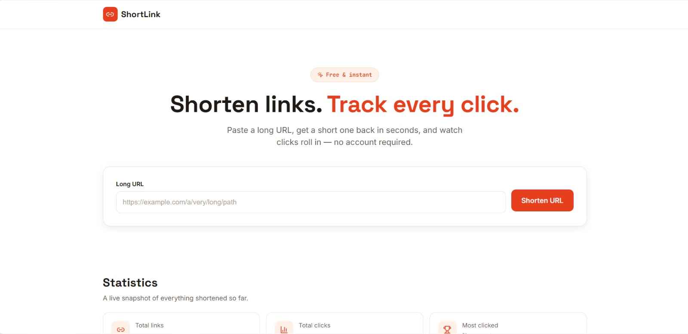

# ShortLink — Full Stack URL Shortener

Paste a long URL, get a short one back, and track clicks on it — in real time, backed by a real database, deployed live.

**🔗 Live demo:** [https://shortlink-sigma-six.vercel.app](https://shortlink-sigma-six.vercel.app)
**⚙️ Backend API:** [https://shortlink-h6dv.onrender.com](https://shortlink-h6dv.onrender.com)
**📦 Repo:** [https://github.com/Akanksha-git134/ShortLink.git](https://github.com/Akanksha-git134/ShortLink.git)

---

## At a glance




<!-- Optional: a short GIF demo makes this section much stronger.
Record a ~10-15 second clip (shorten a URL → see it in history → click delete)
with ScreenToGif (Windows) or Kap (Mac), save it as demo.gif in the repo root,
then uncomment the line below: -->
<!--  -->

**What it does:** paste any URL → get a short link → visiting it redirects and counts the click → everything persists in MongoDB, visible in a live History and Statistics view.

**Why this one's worth a closer look:**
- **Fully working, not a mockup** — every button on the live demo hits a real deployed backend and a real database, not local/fake state.
- **Delete included** — beyond the minimum spec (create, redirect+count, list), links can be removed via a dedicated `DELETE` endpoint, with a confirm-before-destroy guard.
- **Handles the edges, not just the happy path** — empty input, malformed URLs, network failures, and empty states are all handled with real user-facing messages, not silent failures.
- **Clean separation of concerns** — routes never contain logic, all HTTP calls funnel through one `services/api.js`, and one atomic `findOneAndUpdate` prevents click-count race conditions under concurrent traffic. (Happy to walk through any of this line by line.)
- **Fully responsive**, 320px through 1920px, with visible focus states and semantic HTML throughout.

---

## Overview

ShortLink lets a user paste any long URL and instantly generates a short, shareable link. Visiting the short link redirects to the original URL and increments a click counter. A history view shows every link created so far, along with aggregate statistics (total links, total clicks, most-clicked link).

The project intentionally stays small and readable — no user accounts, no link expiry, no admin panel — because those weren't part of the brief, and adding them would be complexity for its own sake rather than complexity the product needs. (See **Future Improvements** below for where those would go next.)

---

## Tech Stack

**Frontend**
- React 18 (Vite)
- Axios — HTTP client
- lucide-react — icons
- Plain CSS with design tokens (CSS variables) — no framework, kept intentionally light

**Backend**
- Node.js
- Express.js
- Mongoose (MongoDB ODM)

**Database**
- MongoDB Atlas (free tier)

**Deployment**
- Frontend → Vercel
- Backend → Render

---

## Folder Structure

```
url-shortener/
├── backend/
│   ├── src/
│   │   ├── config/db.js               # MongoDB connection
│   │   ├── models/Link.js             # Mongoose schema
│   │   ├── controllers/link.controller.js
│   │   ├── routes/link.routes.js
│   │   ├── middleware/errorHandler.js
│   │   ├── utils/generateShortCode.js
│   │   └── app.js                     # Express app (middleware + routes)
│   ├── server.js                      # Entry point
│   ├── .env.example
│   └── package.json
│
├── frontend/
│   ├── src/
│   │   ├── components/                # Navbar, Hero, UrlForm, ResultCard,
│   │   │                               #   StatsPanel, LinkCard, LinkHistory,
│   │   │                               #   Toast, Footer
│   │   ├── pages/Home.jsx             # Composes all sections
│   │   ├── hooks/useToasts.js
│   │   ├── services/api.js            # All axios calls live here
│   │   ├── utils/validators.js        # isValidUrl, formatDate, truncateMiddle
│   │   ├── App.jsx
│   │   ├── main.jsx
│   │   └── index.css                  # Design tokens + global styles
│   ├── .env.example
│   └── package.json
│
└── README.md
```

---

## Installation

### Prerequisites
- Node.js 18+
- A MongoDB Atlas account (free tier is enough) — [setup guide](https://www.mongodb.com/cloud/atlas/register)

### 1. Clone the repository
```bash
git clone https://github.com/YOUR-USERNAME/url-shortener.git
cd url-shortener
```

### 2. Backend setup
```bash
cd backend
npm install
cp .env.example .env
```
Edit `.env` and add your MongoDB connection string:
```
MONGO_URI=mongodb+srv://<username>:<password>@cluster0.xxxxx.mongodb.net/urlshortener
PORT=5000
```
Run it:
```bash
npm run dev
```

### 3. Frontend setup
In a separate terminal:
```bash
cd frontend
npm install
cp .env.example .env
npm run dev
```
Open the printed local URL (typically `http://localhost:5173`).

---

## API Documentation

Base URL (local): `http://localhost:5000`

### `POST /api/shorten`
Creates a short link for a given URL.

**Request body**
```json
{ "url": "https://example.com/a/very/long/path" }
```

**Success response** — `201 Created`
```json
{ "shortCode": "aB3xY9" }
```

**Error response** — `400 Bad Request`
```json
{ "message": "Please provide a valid URL (include http:// or https://)." }
```

---

### `GET /:shortCode`
Redirects to the original URL and increments the click count.

- **Success** — `302 Found`, redirects to `originalUrl`
- **Not found** — `404 Not Found`
  ```json
  { "message": "Short link not found." }
  ```

---

### `GET /api/links`
Returns all links, newest first.

**Success response** — `200 OK`
```json
[
  {
    "_id": "665f1a2b3c4d5e6f7a8b9c0d",
    "originalUrl": "https://example.com/a/very/long/path",
    "shortCode": "aB3xY9",
    "clickCount": 3,
    "createdAt": "2026-08-01T12:34:56.000Z"
  }
]
```

---

### `DELETE /api/links/:shortCode`
Removes a link. Not part of the original minimum spec — added because it's a genuinely useful piece of CRUD completeness for a links list.

- **Success** — `200 OK`
  ```json
  { "message": "Link deleted." }
  ```
- **Not found** — `404 Not Found`
  ```json
  { "message": "Short link not found." }
  ```

---

## Deployment

Full step-by-step instructions (GitHub push, Render setup, Vercel setup, environment variables, CORS, troubleshooting) are in [`DEPLOYMENT.md`](./DEPLOYMENT.md).

Quick summary:
1. Push this repo to GitHub.
2. Deploy `backend/` to Render (Root Directory: `backend`, Start Command: `npm start`, add `MONGO_URI` env var).
3. Deploy `frontend/` to Vercel (Root Directory: `frontend`, add `VITE_API_BASE_URL` and `VITE_SHORT_URL_BASE` pointing at your Render URL).

---

## Future Improvements

- **Basic auth** — let users sign in to see only their own links, instead of a shared global history.
- **Custom short codes** — let users pick their own alias instead of a random one.
- **Link expiry** — optional TTL after which a short link stops redirecting.
- **QR code generation** — render a scannable QR code alongside each short link.
- **Click analytics** — track referrer, device, or location per click, not just a raw count.
- **Rate limiting** — prevent abuse of the `/api/shorten` endpoint.
- **Unit tests** — Jest/Supertest coverage for the controller functions and validators.

---

## License

Built as an internship learning project. Free to use as a reference.